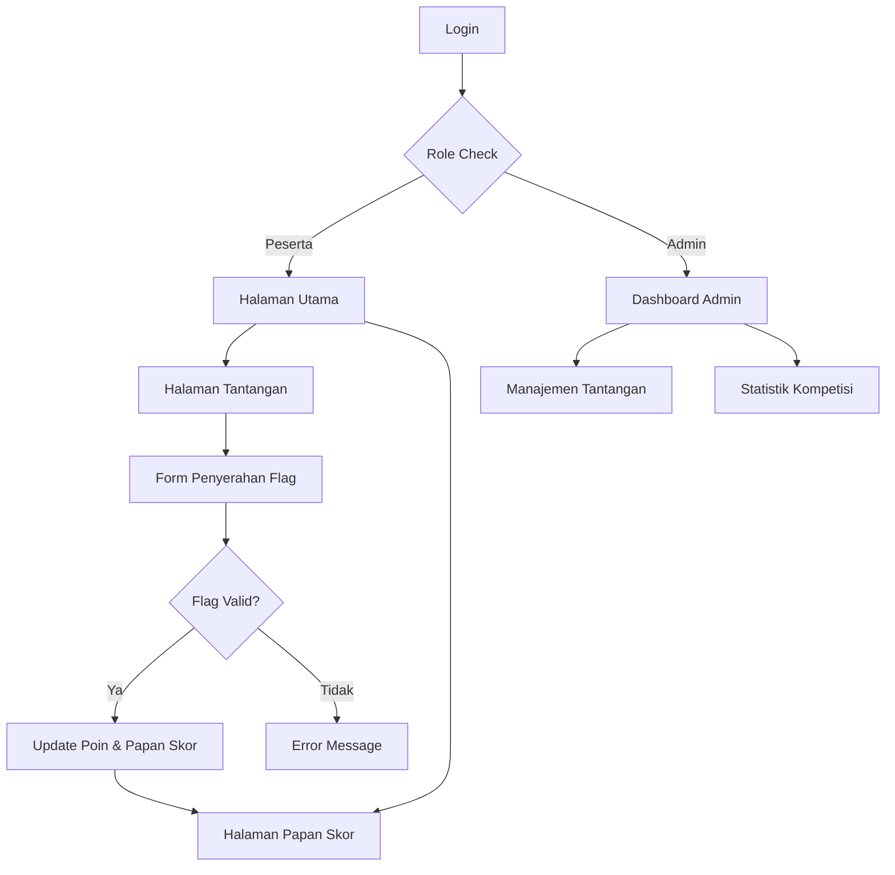

## 1. Gambaran Produk
Aegis CTF adalah platform Capture The Flag yang profesional dan modern, dirancang untuk kompetisi keamanan siber. Platform ini memungkinkan peserta untuk menyelesaikan tantangan keamanan dalam berbagai kategori dan bersaing secara real-time di papan skor.

Platform ini menyelesaikan masalah kebutuhan akan sistem CTF yang dapat diandalkan dengan antarmuka yang intuitif, memungkinkan penyelenggara kompetisi untuk mengelola tantangan dengan mudah dan peserta untuk menyerahkan flag secara efisien.

Target pasar: Komunitas keamanan siber, penyelenggara kompetisi CTF, dan organisasi yang ingin menguji keterampilan keamanan tim mereka.

## 2. Fitur Utama

### 2.1 Peran Pengguna
| Peran | Metode Registrasi | Izin Inti |
|------|---------------------|------------------|
| Peserta | Email atau OAuth (Google/GitHub) | Melihat tantangan, menyerahkan flag, melihat papan skor |
| Administrator | Ditetapkan oleh sistem | Mengelola tantangan, melihat statistik, mengelola pengguna |

### 2.2 Modul Fitur
Platform Aegis CTF terdiri dari halaman-halaman utama berikut:
1. **Halaman Utama**: Navigasi, daftar tantangan, kategori, statistik singkat.
2. **Halaman Tantangan**: Detail tantangan, form penyerahan flag, hint system.
3. **Papan Skor**: Peringkat real-time, pencarian peserta, filter kategori.
4. **Dashboard Admin**: CRUD tantangan, manajemen pengguna, analitik.
5. **Autentikasi**: Login, registrasi, profil pengguna.

### 2.3 Detail Halaman
| Nama Halaman | Modul | Deskripsi Fitur |
|-----------|-------------|---------------------|
| Halaman Utama | Hero Section | Menampilkan logo Aegis CTF dengan animasi neon, deskripsi platform |
| Halaman Utama | Navigasi Utama | Menuju halaman tantangan, papan skor, login, dengan desain cyber-professional |
| Halaman Utama | Daftar Tantangan | Menampilkan kartu-kartu tantangan dengan filter kategori (Web, Crypto, Pwn, Reverse, Forensics) |
| Halaman Tantahan | Detail Tantangan | Menampilkan judul, deskripsi, poin, jumlah solves, dan file/download yang relevan |
| Halaman Tantangan | Form Penyerahan Flag | Input text untuk flag dengan validasi format dan tombol submit |
| Halaman Tantangan | Hint System | Menampilkan hint yang dapat dibuka dengan pengurangan poin |
| Papan Skor | Peringkat Real-time | Tabel peringkat dengan kolom: rank, nama tim, total poin, jumlah solves |
| Papan Skor | Filter & Pencarian | Filter berdasarkan kategori, pencarian nama tim |
| Dashboard Admin | Manajemen Tantangan | Form untuk menambah/mengedit tantangan dengan kategori, poin, flag, deskripsi |
| Dashboard Admin | Daftar Tantangan | Tabel dengan aksi edit/delete, status tantangan |
| Dashboard Admin | Statistik | Grafik solves per kategori, distribusi poin, aktivitas peserta |
| Autentikasi | Login/Register | Form dengan validasi, opsi OAuth, redirect post-login |
| Autentikasi | Profil Pengguna | Edit informasi tim, melihat history solves, statistik pribadi |

## 3. Alur Proses Utama

### Alur Peserta:
1. Pengguna baru melakukan registrasi dengan email atau OAuth
2. Setelah login, pengguna melihat halaman utama dengan daftar tantangan
3. Pengguna memilih tantangan berdasarkan kategori yang diminati
4. Pengguna membaca detail tantangan dan menyelesaikannya secara offline
5. Pengguna menyerahkan flag melalui form yang tersedia
6. Sistem memverifikasi flag dan memberikan poin jika benar
7. Papan skor diperbarui secara otomatis
8. Pengguna dapat melihat posisi mereka di papan skor

### Alur Administrator:
1. Admin login ke dashboard khusus
2. Admin dapat melihat statistik keseluruhan kompetisi
3. Admin menambahkan tantangan baru dengan kategori, poin, dan flag yang sesuai
4. Admin dapat mengedit atau menghapus tantangan yang sudah ada
5. Admin memantau aktivitas peserta dan solves yang terjadi

## 4. Desain Antarmuka Pengguna

### 4.1 Gaya Desain
- **Warna Utama**: Hitam (#0A0A0A) sebagai background utama
- **Warna Aksen**: Cyan (#00FFFF) dan Purple (#8B5CF6) untuk elemen interaktif
- **Gaya Tombol**: Desain cyber-professional dengan border neon dan hover effects
- **Font**: Monospace (JetBrains Mono, Fira Code) untuk nuansa teknis
- **Layout**: Card-based dengan grid system, top navigation dengan glassmorphism effect
- **Ikon**: Ikon neon dengan tema cyber-security, menggunakan emoji atau custom SVG

### 4.2 Ikhtisar Desain Halaman
| Nama Halaman | Modul | Elemen UI |
|-----------|-------------|-------------|
| Halaman Utama | Hero Section | Background gradient gelap dengan partikel animasi, logo Aegis dengan efek glow cyan |
| Halaman Utama | Kartu Tantangan | Border neon cyan, hover effect dengan shadow purple, progress bar kategori |
| Halaman Tantangan | Detail Area | Container dengan border gradient cyan-purple, monospace font untuk teknis |
| Halaman Tantangan | Form Flag | Input dengan underline neon, tombol submit dengan efek pulse |
| Papan Skor | Tabel Peringkat | Row dengan warna berbeda untuk top 3, animasi update real-time |
| Dashboard Admin | Form Tantangan | Input fields dengan border cyan, dropdown kategori dengan custom styling |
| Dashboard Admin | Tabel Data | Striped rows dengan warna gelap, action buttons dengan ikon neon |

### 4.3 Responsivitas
- Desktop-first approach dengan breakpoint utama di 1024px, 768px, dan 480px
- Mobile-adaptive dengan navigation drawer untuk perangkat kecil
- Touch interaction optimization untuk tombol dan form elements
- Grid layout yang menyesuaikan jumlah kolom berdasarkan lebar layar

### 4.4 Animasi dan Efek Visual
- Loading states dengan spinner cyber-professional
- Success/error notifications dengan efek slide-in dan neon glow
- Smooth transitions untuk semua interaktif elements
- Real-time updates di papan skor dengan animasi ranking yang smooth
- Parallax effect untuk hero section di halaman utama