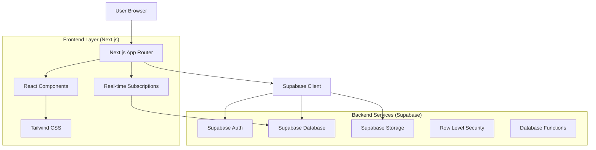
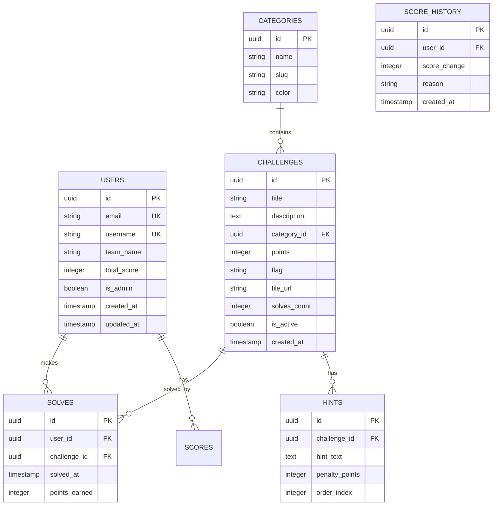

## 1. Desain Arsitektur



## 2. Deskripsi Teknologi

* **Frontend**: Next.js 14 (App Router) + React 18 + TypeScript

* **Styling**: Tailwind CSS 3 dengan plugin khusus untuk efek neon

* **Initialization Tool**: create-next-app dengan TypeScript template

* **Backend**: Supabase (PostgreSQL + Auth + Real-time + Storage)

* **Database**: PostgreSQL 15+ dengan Row Level Security

* **Authentication**: Supabase Auth dengan email/OAuth providers

* **Real-time**: Supabase Realtime untuk papan skor live

* **Deployment**: Vercel dengan edge functions support

## 3. Definisi Route

| Route               | Tujuan                                                 |
| ------------------- | ------------------------------------------------------ |
| `/`                 | Halaman utama dengan daftar tantangan dan hero section |
| `/challenges`       | Daftar semua tantangan dengan filter kategori          |
| `/challenges/[id]`  | Detail tantangan dan form penyerahan flag              |
| `/scoreboard`       | Papan skor real-time dengan peringkat peserta          |
| `/auth/login`       | Halaman login dengan email/OAuth                       |
| `/auth/register`    | Halaman registrasi peserta baru                        |
| `/auth/callback`    | Callback handler untuk OAuth dan email confirmation    |
| `/profile`          | Profil pengguna dan history solves                     |
| `/admin/dashboard`  | Dashboard admin untuk manajemen tantangan              |
| `/admin/challenges` | CRUD tantangan untuk admin                             |
| `/admin/users`      | Manajemen pengguna untuk admin                         |
| `/api/flag/submit`  | API endpoint untuk verifikasi flag                     |
| `/api/scoreboard`   | API untuk data papan skor real-time                    |

## 4. Definisi API

### 4.1 API Inti

**Verifikasi Flag**

```
POST /api/flag/submit
```

Request:

| Nama Parameter | Tipe   | Wajib | Deskripsi                  |
| -------------- | ------ | ----- | -------------------------- |
| challenge\_id  | string | true  | ID tantangan               |
| flag           | string | true  | Flag yang diserahkan       |
| user\_id       | string | true  | ID pengguna (dari session) |

Response:

| Nama Parameter | Tipe    | Deskripsi                       |
| -------------- | ------- | ------------------------------- |
| success        | boolean | Status verifikasi flag          |
| message        | string  | Pesan hasil (correct/incorrect) |
| points         | number  | Poin yang didapat (jika benar)  |
| new\_score     | number  | Total poin terbaru pengguna     |

Example Response:

```json
{
  "success": true,
  "message": "Flag benar!",
  "points": 100,
  "new_score": 450
}
```

**Update Papan Skor Real-time**

```
GET /api/scoreboard
```

Response:

| Nama Parameter | Tipe      | Deskripsi             |
| -------------- | --------- | --------------------- |
| rankings       | array     | Array objek ranking   |
| last\_update   | timestamp | Waktu update terakhir |

## 5. Model Data

### 5.1 Definisi Model Data



### 5.2 Definisi Bahasa Data (DDL)

**Tabel Pengguna (users)**

```sql
-- Membuat tabel pengguna
CREATE TABLE users (
    id UUID PRIMARY KEY DEFAULT gen_random_uuid(),
    email VARCHAR(255) UNIQUE NOT NULL,
    username VARCHAR(50) UNIQUE NOT NULL,
    team_name VARCHAR(100) NOT NULL,
    total_score INTEGER DEFAULT 0,
    is_admin BOOLEAN DEFAULT FALSE,
    created_at TIMESTAMP WITH TIME ZONE DEFAULT NOW(),
    updated_at TIMESTAMP WITH TIME ZONE DEFAULT NOW()
);

-- Membuat index untuk performa query
CREATE INDEX idx_users_total_score ON users(total_score DESC);
CREATE INDEX idx_users_username ON users(username);
```

**Tabel Kategori (categories)**

```sql
CREATE TABLE categories (
    id UUID PRIMARY KEY DEFAULT gen_random_uuid(),
    name VARCHAR(50) NOT NULL,
    slug VARCHAR(50) UNIQUE NOT NULL,
    color VARCHAR(7) DEFAULT '#00FFFF',
    created_at TIMESTAMP WITH TIME ZONE DEFAULT NOW()
);

-- Data awal kategori
INSERT INTO categories (name, slug, color) VALUES
('Web', 'web', '#00FFFF'),
('Cryptography', 'crypto', '#8B5CF6'),
('Pwn', 'pwn', '#EF4444'),
('Reverse Engineering', 'reverse', '#F59E0B'),
('Forensics', 'forensics', '#10B981');
```

**Tabel Tantangan (challenges)**

```sql
CREATE TABLE challenges (
    id UUID PRIMARY KEY DEFAULT gen_random_uuid(),
    title VARCHAR(200) NOT NULL,
    description TEXT NOT NULL,
    category_id UUID REFERENCES categories(id) ON DELETE CASCADE,
    points INTEGER NOT NULL CHECK (points > 0),
    flag VARCHAR(255) NOT NULL,
    file_url VARCHAR(500),
    solves_count INTEGER DEFAULT 0,
    is_active BOOLEAN DEFAULT TRUE,
    created_at TIMESTAMP WITH TIME ZONE DEFAULT NOW(),
    updated_at TIMESTAMP WITH TIME ZONE DEFAULT NOW()
);

CREATE INDEX idx_challenges_category ON challenges(category_id);
CREATE INDEX idx_challenges_points ON challenges(points DESC);
CREATE INDEX idx_challenges_active ON challenges(is_active);
```

**Tabel Solves (solves)**

```sql
CREATE TABLE solves (
    id UUID PRIMARY KEY DEFAULT gen_random_uuid(),
    user_id UUID REFERENCES users(id) ON DELETE CASCADE,
    challenge_id UUID REFERENCES challenges(id) ON DELETE CASCADE,
    solved_at TIMESTAMP WITH TIME ZONE DEFAULT NOW(),
    points_earned INTEGER NOT NULL,
    UNIQUE(user_id, challenge_id)
);

CREATE INDEX idx_solves_user ON solves(user_id);
CREATE INDEX idx_solves_challenge ON solves(challenge_id);
CREATE INDEX idx_solves_time ON solves(solved_at DESC);
```

### 5.3 Kebijakan Akses Row Level Security (RLS)

**Kebijakan untuk tabel challenges:**

```sql
-- Semua pengguna dapat melihat tantangan yang aktif
ALTER TABLE challenges ENABLE ROW LEVEL SECURITY;

CREATE POLICY "Pengguna dapat melihat tantangan aktif" ON challenges
    FOR SELECT
    USING (is_active = TRUE);

-- Admin dapat melihat dan mengelola semua tantangan
CREATE POLICY "Admin dapat mengelola tantangan" ON challenges
    FOR ALL
    USING (
        EXISTS (
            SELECT 1 FROM users 
            WHERE id = auth.uid() AND is_admin = TRUE
        )
    );
```

**Kebijakan untuk tabel users:**

```sql
-- Pengguna dapat melihat profil mereka sendiri
CREATE POLICY "Pengguna dapat melihat profil sendiri" ON users
    FOR SELECT
    USING (id = auth.uid());

-- Admin dapat melihat semua pengguna
CREATE POLICY "Admin dapat melihat semua pengguna" ON users
    FOR SELECT
    USING (
        EXISTS (
            SELECT 1 FROM users 
            WHERE id = auth.uid() AND is_admin = TRUE
        )
    );
```

**Kebijakan untuk tabel solves:**

```sql
-- Semua pengguna dapat melihat solves (untuk papan skor)
CREATE POLICY "Semua dapat melihat solves" ON solves
    FOR SELECT
    USING (true);

-- Pengguna hanya dapat membuat solves untuk diri sendiri
CREATE POLICY "Pengguna dapat membuat solves sendiri" ON solves
    FOR INSERT
    WITH CHECK (user_id = auth.uid());
```

## 6. Konfigurasi Supabase

### 6.1 Fungsi Database untuk Update Skor

```sql
-- Fungsi untuk update total skor pengguna setelah solve
CREATE OR REPLACE FUNCTION update_user_score()
RETURNS TRIGGER AS $$
BEGIN
    -- Update total skor pengguna
    UPDATE users 
    SET total_score = total_score + NEW.points_earned,
        updated_at = NOW()
    WHERE id = NEW.user_id;
    
    -- Update solves count untuk tantangan
    UPDATE challenges 
    SET solves_count = solves_count + 1,
        updated_at = NOW()
    WHERE id = NEW.challenge_id;
    
    RETURN NEW;
END;
$$ LANGUAGE plpgsql;

-- Trigger untuk memanggil fungsi setelah insert solves
CREATE TRIGGER trigger_update_score
    AFTER INSERT ON solves
    FOR EACH ROW
    EXECUTE FUNCTION update_user_score();
```

### 6.2 Real-time Subscriptions

```typescript
// Contoh subscription untuk papan skor real-time
const scoreboardSubscription = supabase
  .channel('scoreboard-updates')
  .on('postgres_changes', 
    { event: 'UPDATE', schema: 'public', table: 'users' },
    payload => {
      // Handle score updates
      updateScoreboardDisplay(payload.new);
    }
  )
  .subscribe();
```

## 7. Environment Variables

```bash
# Supabase Configuration
NEXT_PUBLIC_SUPABASE_URL=your_supabase_project_url
NEXT_PUBLIC_SUPABASE_ANON_KEY=your_supabase_anon_key
SUPABASE_SERVICE_ROLE_KEY=your_service_role_key

# Application Configuration
NEXT_PUBLIC_SITE_URL=https://aegis-ctf.vercel.app
NEXT_PUBLIC_CTF_NAME="Aegis CTF"
NEXT_PUBLIC_MAX_TEAM_SIZE=5

# Optional: OAuth Providers
NEXT_PUBLIC_GOOGLE_CLIENT_ID=your_google_client_id
NEXT_PUBLIC_GITHUB_CLIENT_ID=your_github_client_id
```

